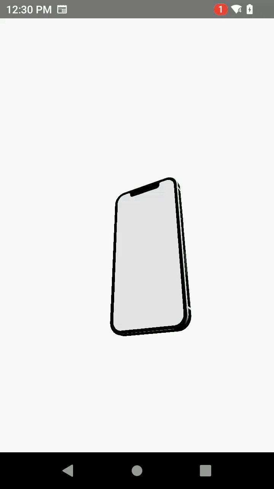

This project uses three js , three fiber and drei to render 3D models
React Native CLI + Expo support

## Demo

supported links:

https://r3f.docs.pmnd.rs/getting-started/installation#:~:text=To%20get%20started%2C%20create%20an%20app%20via%20expo%20or%20react%2Dnative

https://github.com/TiagoCavalcante/r3f-native-orbitcontrols

https://github.com/pmndrs/drei

https://gltf.pmnd.rs/ (for converting .glb to jsx)

https://github.com/pmndrs

https://gltf.report/
https://gltf-viewer.donmccurdy.com/
https://gltf.pmnd.rs/

Special thanks to Engineer Codewala(https://www.youtube.com/watch?v=1ahs5R1mPhw)
